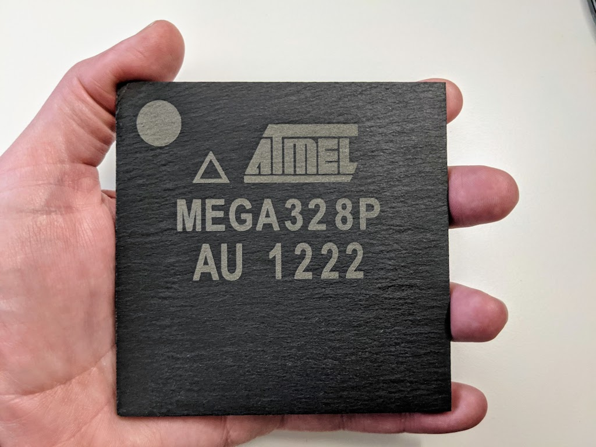
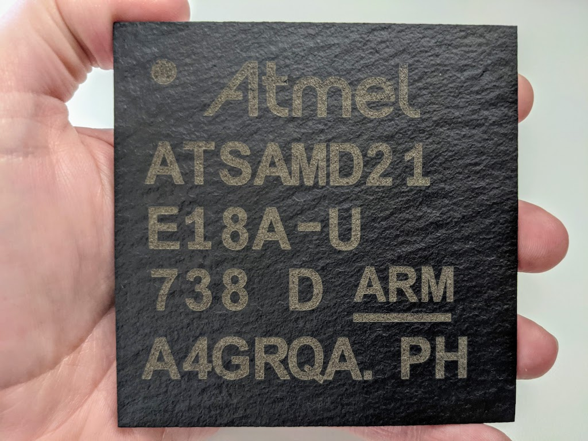
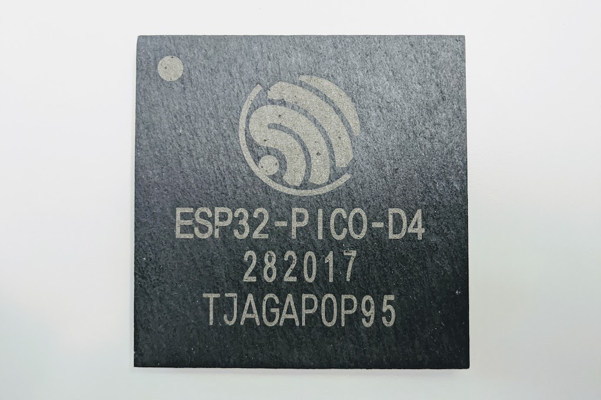

# Macrochips

A collection of laser engraved, 4 inch slate tile microchip coasters.

More info: https://www.evilgeniuslabs.org/macrochips

I have a [Flux3D Beamo](https://flux3dp.com/beamo/) 30W CO2 laser.  I use the metal engraving preset (50% power, 80mm/s speed).

A light coat of mineral oil before engraving makes them shiny, if that's the look you want.

For custom designed, laser engraved items such as these, contact me here: https://www.evilgeniuslabs.org/contact

